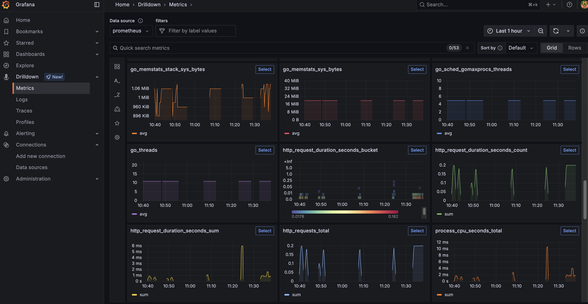
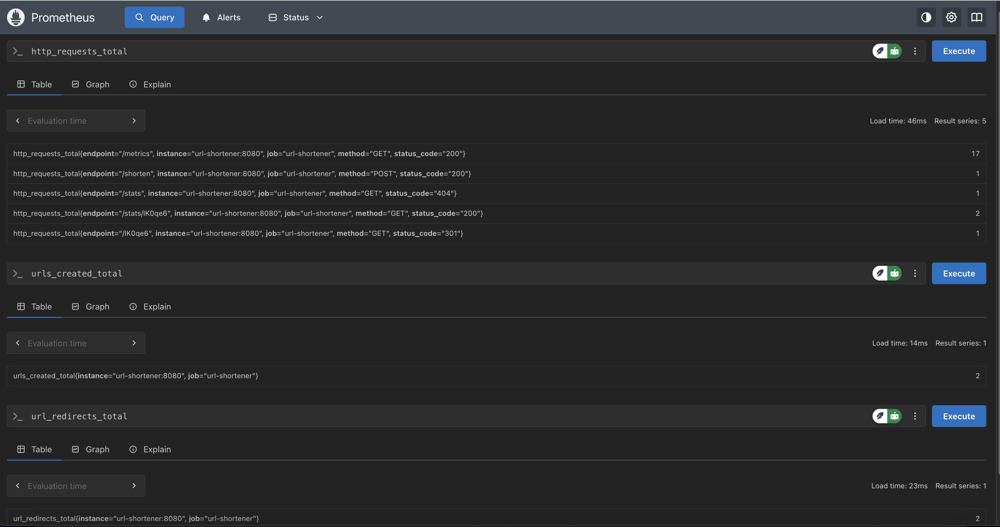

# URL Shortener Service

A simple URL shortener service written in Go with Prometheus monitoring and a CI/CD pipeline.

## Features

- 🔗 URL shortening
- 📊 Click tracking
- 📈 Prometheus metrics
- 🐳 Docker support
- 🚀 CI/CD with GitHub Actions
- ✅ Health check endpoint

## API Endpoints

### Shorten URL
```bash
POST /shorten
Content-Type: application/json

{
  "url": "https://example.com/very-long-url"
}
```

### Redirect
```bash
GET /{shortCode}
```

### View statistics
```bash
GET /stats/{shortCode}
```

### Health check
```bash
GET /health
```

### Metrics (Prometheus)
```bash
GET /metrics
```

## Running the Project

### Development
```bash
go mod tidy
go run main.go
```

### With Docker Compose
```bash
docker-compose up -d
```

The services will run at:
- URL Shortener: http://localhost:8080
- Prometheus: http://localhost:9090
- Grafana: http://localhost:3000 (admin/admin)

## Testing the API

```bash
# Shorten URL
curl -X POST http://localhost:8080/shorten \
  -H "Content-Type: application/json" \
  -d '{"url": "https://google.com"}'

# Access shortened URL
curl -L http://localhost:8080/{shortCode}

# View stats
curl http://localhost:8080/stats/{shortCode}

# Health check
curl http://localhost:8080/health

# Metrics
curl http://localhost:8080/metrics
```

## Prometheus Metrics

- `http_requests_total`: Total number of HTTP requests
- `http_request_duration_seconds`: Response time
- `urls_created_total`: Number of URLs created
- `url_redirects_total`: Number of redirects

## Monitoring Dashboards

Below are example screenshots of the monitoring dashboards:

### Grafana Dashboard



### Prometheus Dashboard




## CI/CD Pipeline

The pipeline runs automatically when:
- Code is pushed to the `main` or `develop` branch
- A Pull Request is created

Steps:
1. **Test**: Run tests and linting
2. **Build**: Build binary and Docker image
3. **Deploy**: Deploy to production (only when pushing to main)

## What I learned from this project

### Golang:
- HTTP server with Gorilla Mux
- Middleware pattern
- Graceful shutdown
- Error handling
- Interface and dependency injection

### Prometheus:
- Custom metrics
- Histogram and Counter
- Labels and monitoring best practices

### CI/CD:
- GitHub Actions workflows
- Docker build and push
- Testing automation
- Environment-based deployment

### DevOps:
- Docker containerization
- Docker Compose orchestration
- Health checks
- Configuration management
